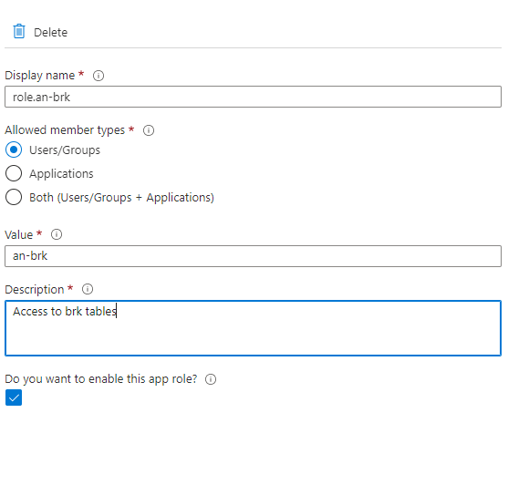

# Apache Superset on Google Cloud Run
This repository deploys Apache Superset to Google Cloud Run and configures it to use Oauth from Azure AD for authentication. Thank you to [K12](https://github.com/K12-Analytics-Engineering/superset) for the starting point to get this up and running.

> 

This repository is designed to be opened on a machine with [Docker](https://www.docker.com/) installed. When opened in [Visual Studio Code](https://code.visualstudio.com/) with the [Remote Containers](https://marketplace.visualstudio.com/items?itemName=ms-vscode-remote.remote-containers) extension installed, Visual Studio Code can open the repository in its own container using all Python requirements specified in this repository's `requirements.txt` file.

Prior to opening the repo in dev containers, copy `.env-sample` to create your own `.env` file. Update the environment variables appropriately.


## To make changes
When making changes to the files in src/, this needs to be deployed to Cloud Run. Can be done without devcontainer 

```bash
gcloud auth  login

gcloud builds submit \
    --tag europe-north1-docker.pkg.dev/$GOOGLE_CLOUD_PROJECT/my-repository/superset src/.;

gcloud beta run deploy superset \
    --image=europe-north1-docker.pkg.dev/$GOOGLE_CLOUD_PROJECT/my-repository/superset \
    --allow-unauthenticated \
    --port=8088 \
    --cpu=2 \
    --memory=4096Mi \
    --min-instances=0 \
    --max-instances=1 \
	--set-secrets=CONNECTION_STRING=superset-connection-string:3,SECRET_KEY=superset-secret-key:1,AZURE_ID=AZURE_ID:1,AZURE_SECRET=CLIENT_SECRET:1,TENANT_ID=TENANT_ID:1 \
    --set-cloudsql-instances brk-supersetdb \
    --platform=managed \
    --service-account superset@$GOOGLE_CLOUD_PROJECT.iam.gserviceaccount.com \
    --region=europe-north1;

```

## Upgrade 
To upgrade to a newer version of Superset, it is needed to spin up a local devcontainer with a Cloud SQL proxy connection and run the upgrade scripts from there. Make sure you up the version of both requirements.txt in base directory and src/.

```bash
gcloud auth  login
gcloud auth application-default login
gcloud config set project $GOOGLE_CLOUD_PROJECT

/cloud_sql_proxy $GOOGLE_CLOUD_PROJECT:europe-north1:brk-supersetdb &

superset db upgrade
superset init

```

## Azure AD OAuth setup and maintenance
To set up roles is done in [aad](aad.portal.azure.com) -> App Registrations -> Superset -> App roles.



To assign this role to an Azure AD Security group, go to [aad](aad.portal.azure.com) -> Enterprise Applications -> Superset -> Users and Groups.

Add an Azure AD group, and then press edit assignment to select the role you created in App roles earlier.

To grant a user access, they need to be assigned the correct group in Azure AD and they will gain access to the assigned datasets and dashboards in Superset.